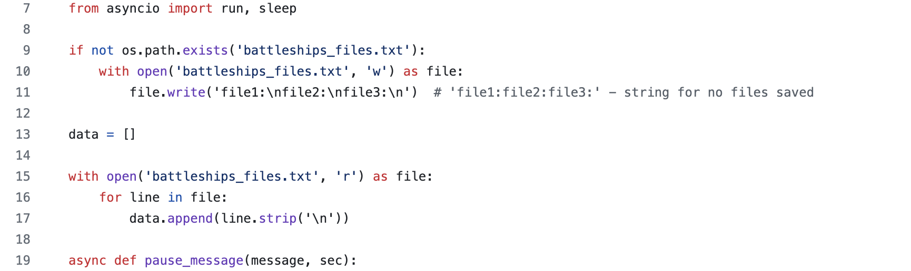

# JamieCook1517 👋

<!--
**JamieCook1517/JamieCook1517** is a ✨ _special_ ✨ repository because its `README.md` (this file) appears on your GitHub profile.

Here are some ideas to get you started:

- 🔭 I’m currently working on ...
- 🌱 I’m currently learning ...
- 👯 I’m looking to collaborate on ...
- 🤔 I’m looking for help with ...
- 💬 Ask me about ...
- 📫 How to reach me: ...
- 😄 Pronouns: ...
- ⚡ Fun fact: ...
-->

<picture>
 <source media="(prefers-color-scheme: dark)" srcset="gitdark.png">
 <source media="(prefers-color-scheme: light)" srcset="gitlight.png">
 
</picture>

## About

Welcome to my GitHub profile! I am a Junior Software Engineer who started out as a university graduate in Music and is now eager to begin a career in tech. I am currently working on projects on Python and have already uploaded some that you can view. Also have proficiency in JavaScript.

## Repositories

## Links
